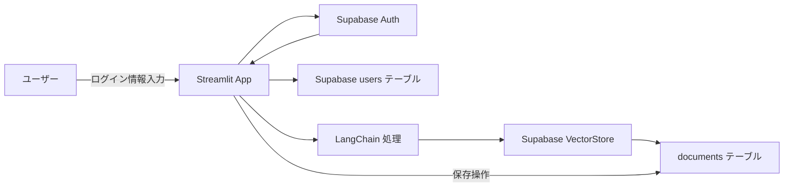

# Streamlit + LangChain + Supabase ハンズオン

このプロジェクトは、Streamlit、LangChain、Supabaseを組み合わせたアプリケーションのハンズオン用リポジトリです。

## アプリケーションフロー



## セットアップ手順

### 1. Supabase に `users` テーブルを追加

1. Supabase ダッシュボードで **Database > Table Editor** へ  
2. 「New Table」をクリックし、テーブル名を `users` に設定  
3. カラムを以下のように作成  
   - `id`       – type: `uuid`, 主キー, Default: `gen_random_uuid()`  
   - `email`    – type: `text`  
   - `created_at` – type: `timestamp`, Default: `now()`  
4. RLS（Row Level Security）を必要に応じて有効化し、認証ユーザーだけ自分のレコードを読めるようにポリシーを設定  

### 2. プロジェクト構成／環境変数

```
streamlit-langchain-supabase/
├── .env                # 環境変数
├── app.py              # メインアプリ
└── requirements.txt    # pip freeze
```

`.env`ファイルには以下の環境変数を設定してください：

```dotenv
SUPABASE_URL=https://＜あなたのプロジェクトID＞.supabase.co
SUPABASE_KEY=＜public-anon-key＞
```

### 3. アプリケーションの実装

`app.py`にはユーザー認証、ユーザー情報の保存、ドキュメントの保存機能が実装されています。

主な機能：
1. Supabase認証によるログイン・新規登録
2. ユーザー情報をusersテーブルに保存
3. LangChainによるテキストのベクトル化
4. ベクトル化されたテキストをSupabaseのVectorStoreに保存

### 4. 動作確認

```bash
streamlit run app.py
```

1. **初回**：新規登録ボタンでアカウント作成  
2. **ログイン**：登録済みユーザーでログイン  
3. **テーブル確認**：  
   - `users` テーブルにユーザーレコードが追加されている  
   - `documents` テーブルに保存操作でレコードが追加されている  

## 注意点

- RLSを設定している場合、適切なポリシーを設定しないとテーブルへの書き込みがエラーになる場合があります
- Supabaseの最新バージョンではAPIが変更されている場合があるため、エラーが発生した場合はドキュメントを確認してください

## トラブルシューティング

### RLSエラーが発生する場合

RLSポリシーを適切に設定するか、サービスロールキーを使用してRLSをバイパスする方法があります：

```python
# .envファイルにSUPABASE_SERVICE_KEYを追加
SUPABASE_SERVICE_KEY=＜service-role-key＞

# app.pyでサービスロールクライアントを使用
sb_admin = create_client(SUPABASE_URL, SUPABASE_SERVICE_KEY)
# このクライアントでデータを挿入することでRLSをバイパス
```

## 課題
1. Googleアカウントでの認証機能実装
2. 新規で/dashboardページを作成し、認証されたuserは/dashboardへリダイレクト
3. 認証されていないuserは認証ページへリダイレクト